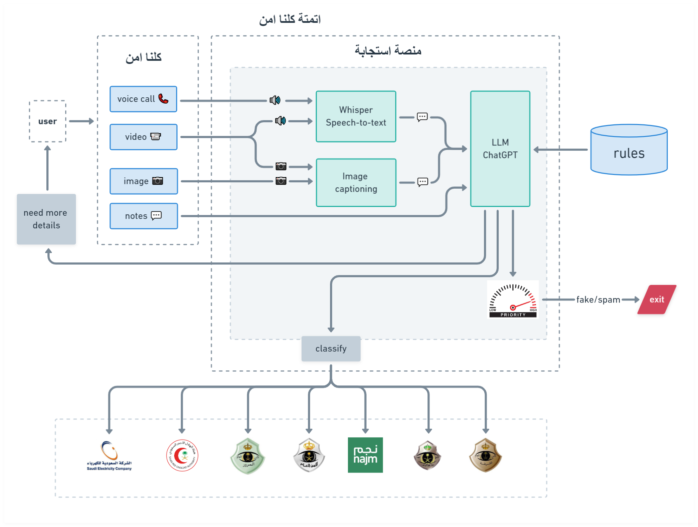

# AI Emergency classification

⚠ not all code was uploaded, this repo is not fully functional ⚠

This is the 2nd place winning project for the 3rd Absher hackathon out of 4000 competing teams. This code was put together in a few days (code quality may not be the best).


See winner announcements [here](https://twitter.com/Absher/status/1660583471155228673) and [here](https://www.linkedin.com/feed/update/urn:li:activity:7066683163514683392/)


The idea is to classify emergencies from any media (video, image, audio, text) and then redirect to the correct emergency service by using a multimodal Large Language Model (LLM).

The user can upload any media (video, image, audio, text) and multiple deep learning models and a Large Language Model agent will classify the emergency and immediately redirect to the correct emergency service.

The LLM is in charge of taking the unstructured output of the upstream models and structuring it and then classifying based on the rules in the `config.json`

- [BLIP2](https://huggingface.co/docs/transformers/main/model_doc/blip-2) image captioning model
- [OpenAI whisper](https://github.com/openai/whisper) speech-to-text model



Video here: https://www.youtube.com/watch?v=VMoDf4XyOq4


## Future work

Currently we use a feature engineering approach where we use Speech-to-text and image captioning models to extract information as text and then feed it into the downstream model (the LLM), however this could be improved by fusing the image captioning model with the LLM such as miniGPT4, I have tried this however the results were worse and slower, so until I find a better multimodal LLM, I will be sticking with this appraoch.

- [minGPT4](https://huggingface.co/Vision-CAIR/MiniGPT-4)

## setup

```
conda create -n absherthon python=3.10 -y 
conda activate absherthon
pip install -r requirements.txt
conda install pytorch torchvision torchaudio pytorch-cuda=11.7 -c pytorch -c nvidia -y
```


pip install --upgrade accelerate
python app.py 


run

```
export OPENAI_API_KEY=sk-... # you must get this from openai.com
python demo.py
```
